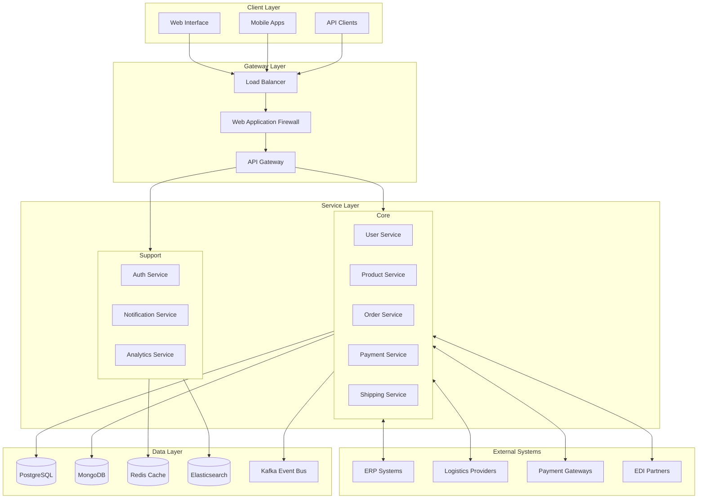

# Nexus Platform

Enterprise-grade B2B trade facilitation platform enabling seamless international trade operations through integrated marketplace functionality, trade intelligence, logistics management, payment processing, and compliance tools.


## Overview

Nexus Platform is a comprehensive B2B trade solution designed for medium to large organizations across manufacturing, wholesale, and distribution industries. The platform leverages standards-based integration (eCl@ss, GS1, EDIFACT) with AI-powered insights to streamline international trade operations.

### Key Features

- Enterprise-grade marketplace functionality
- Advanced trade intelligence and analytics
- Integrated logistics management
- Secure payment processing
- Automated compliance handling
- Real-time supply chain visibility

## System Architecture



## Technology Stack

| Component | Technology | Version | Purpose |
|-----------|------------|---------|----------|
| Backend Services | Java/Spring Boot | 17/3.1.x | Core services implementation |
| Frontend | Angular | 16.x | Web application framework |
| Database | PostgreSQL | 15.x | Primary data store |
| Cache | Redis | 7.0.x | Distributed caching |
| Message Queue | Apache Kafka | 3.4.x | Event streaming |
| Search Engine | Elasticsearch | 8.8.x | Full-text search and analytics |
| Container Runtime | Docker | 24.x | Application containerization |
| Orchestration | Kubernetes | 1.27+ | Container orchestration |
| Service Mesh | Istio | 1.18+ | Service networking |

## Quick Start

```bash
# Clone repository
git clone https://github.com/organization/nexus-platform.git
cd nexus-platform

# Install dependencies
./scripts/install-dependencies.sh

# Configure environment
cp .env.example .env
vim .env  # Update configuration

# Start development environment
docker-compose up -d

# Run tests
./scripts/run-tests.sh

# Access application
echo 'Application running at http://localhost:8080'
```

## Security Framework

- OAuth 2.0 + OIDC authentication with MFA support
- Role-based access control (RBAC)
- Data encryption at rest and in transit
- PCI DSS compliance for payment processing
- GDPR and CCPA compliance for data privacy
- Regular security audits and penetration testing
- Automated vulnerability scanning

## Integration Standards

| Standard | Version | Purpose | Implementation |
|----------|---------|---------|----------------|
| eCl@ss | 12.0 | Product classification | REST API integration |
| GS1 | 3.4 | Product identification | GTIN/GLN implementation |
| EDIFACT | D.01B | EDI messaging | Message transformation |
| BMEcat | 2.1 | Catalog exchange | Import/Export handlers |

## Documentation

- [API Documentation](docs/api/README.md)
- [Development Guide](docs/development/README.md)
- [Deployment Guide](docs/deployment/README.md)
- [Security Guide](docs/security/README.md)
- [Integration Guide](docs/integration/README.md)

## System Requirements

### Production Environment
- Kubernetes cluster 1.27+
- AWS infrastructure with multi-region support
- High-availability database setup
- Load balancer with SSL termination
- Network policies and security groups
- Monitoring and logging infrastructure

### Development Environment
- Docker 24.x
- Java Development Kit 17
- Node.js 18.x
- PostgreSQL 15.x
- Redis 7.0.x
- Kafka 3.4.x

## Support

For technical support and inquiries:
- Development Team: dev-team@organization.com
- Operations Team: ops-team@organization.com

## License

Proprietary - All rights reserved

---

Last updated: 2023-09-20
