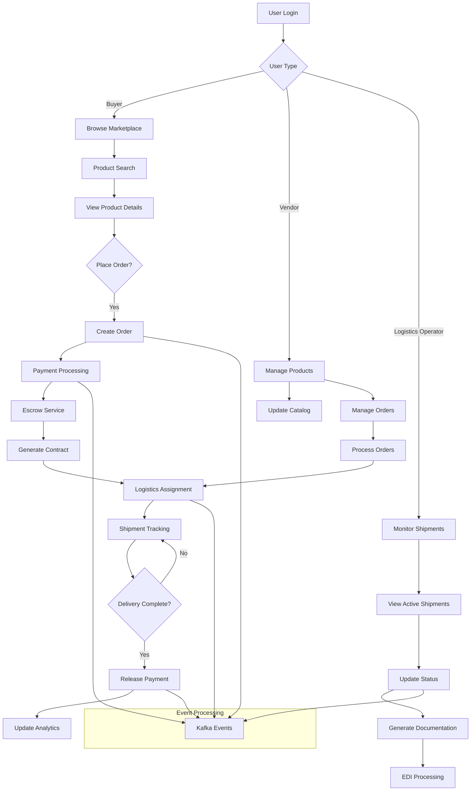
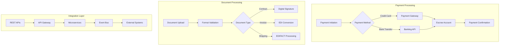
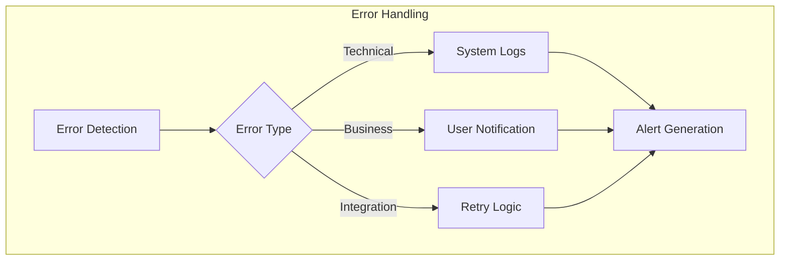
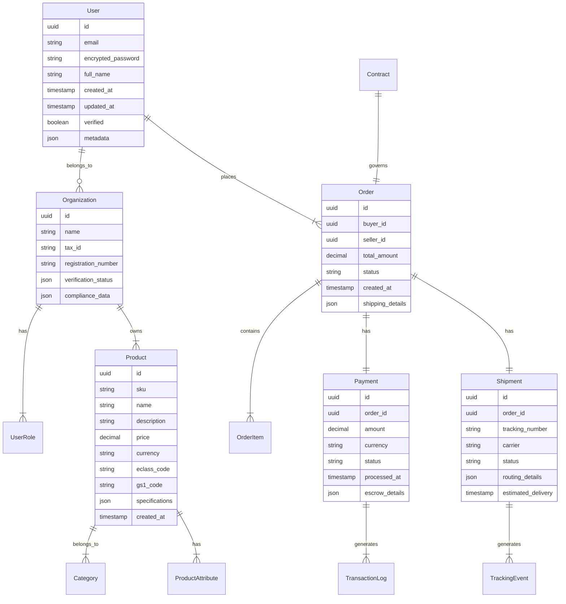
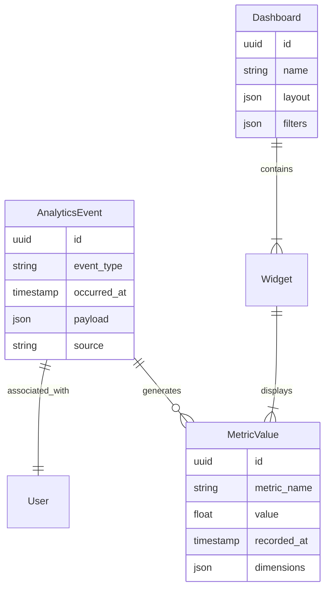
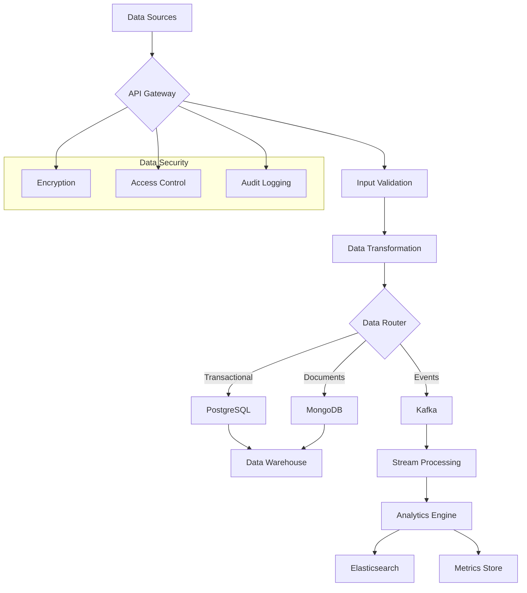
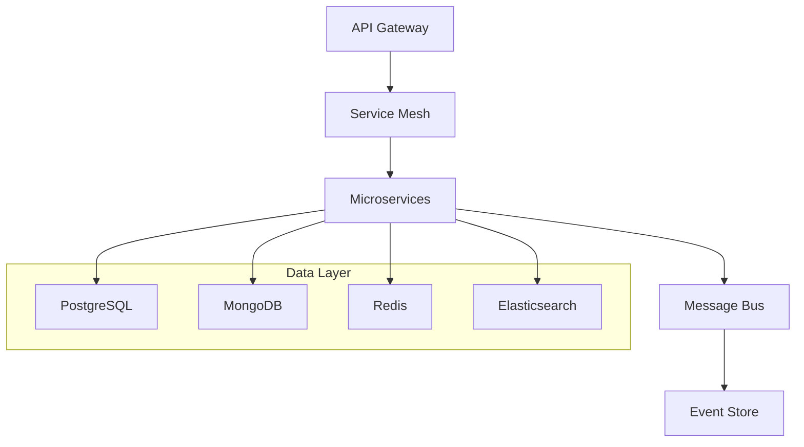

# Product Requirements Document (PRD)

# 1. INTRODUCTION

## 1.1 PURPOSE

This Product Requirements Document (PRD) specifies the functional and non-functional requirements for the Nexus Platform, a B2B trade facilitation solution. The document serves as a comprehensive reference for:

- Development teams implementing the platform
- Project managers overseeing the development lifecycle
- Stakeholders evaluating project progress and alignment
- QA teams designing test strategies
- System architects making technical decisions
- Integration partners understanding interface requirements

## 1.2 SCOPE

The Nexus Platform is a comprehensive B2B trade facilitation solution that streamlines international trade operations through digital transformation. The platform encompasses:

### Core Functionalities
- Marketplace operations with advanced product and vendor discovery
- Trade intelligence and analytics
- End-to-end shipping and logistics management
- Secure payment processing and escrow services
- Digital contract management and compliance

### Key Benefits
- Reduced operational complexity in international trade
- Enhanced visibility across supply chains
- Automated compliance and risk management
- Streamlined communication between trade partners
- Data-driven decision making through analytics

### Technical Boundaries
- Cloud-based microservices architecture
- Integration with external systems via REST and GraphQL APIs
- Support for industry standards (eCl@ss, GS1, BMEcat, EDIFACT)
- Multi-tenant architecture supporting various user roles
- Real-time event processing and notifications

### Exclusions
- Physical logistics operations
- Banking services beyond payment processing
- Custom hardware requirements
- Legacy system migrations

# 2. PRODUCT DESCRIPTION

## 2.1 PRODUCT PERSPECTIVE
The Nexus Platform operates as a cloud-based B2B trade facilitation system within the broader international trade ecosystem. The platform interfaces with:

- External logistics providers through REST/GraphQL APIs
- Payment gateways and banking systems
- Product classification systems (eCl@ss, GS1)
- EDI systems using EDIFACT standards
- Government trade compliance systems
- Enterprise resource planning (ERP) systems
- Business intelligence and analytics tools

## 2.2 PRODUCT FUNCTIONS
- Marketplace Operations
  - User profile management
  - Product/vendor discovery and matching
  - Digital catalog management
  - Order processing and tracking
  - Secure communication channels

- Trade Intelligence
  - Market analytics and reporting
  - AI-powered demand forecasting
  - Performance metrics tracking
  - Custom report generation

- Logistics Management
  - Multi-carrier integration
  - Real-time shipment tracking
  - Route optimization
  - Warehouse management integration

- Financial Services
  - Multi-currency payment processing
  - Escrow service management
  - Invoice generation and tracking
  - Payment dispute resolution

- Compliance Management
  - Digital contract workflows
  - Regulatory compliance checking
  - Trade documentation management
  - Audit trail maintenance

## 2.3 USER CHARACTERISTICS

| User Type | Characteristics | Technical Expertise | Primary Goals |
|-----------|----------------|---------------------|---------------|
| Buyers | Procurement professionals, supply chain managers | Moderate | Product sourcing, cost optimization, supplier management |
| Vendors | Sales teams, export managers | Moderate to High | Market expansion, customer acquisition, order management |
| Logistics Operators | Shipping coordinators, warehouse managers | High | Shipment tracking, route planning, documentation |
| Platform Administrators | IT professionals, support staff | Very High | System maintenance, user support, monitoring |
| Compliance Officers | Legal professionals, trade experts | Moderate | Regulatory compliance, risk management |

## 2.4 CONSTRAINTS

### Technical Constraints
- Must maintain compatibility with legacy EDI systems
- Real-time processing requirements for payment transactions
- Data residency requirements in different jurisdictions
- API rate limits from third-party services
- Browser compatibility requirements (IE11+, Chrome, Firefox, Safari)

### Business Constraints
- Compliance with GDPR, CCPA, and regional data protection laws
- PCI DSS compliance for payment processing
- International trade regulations and sanctions
- Multi-language support requirement
- 99.9% platform availability requirement

### Resource Constraints
- Initial deployment timeline of 12 months
- Development team size of 50 members
- Infrastructure budget limitations
- Third-party service integration costs

## 2.5 ASSUMPTIONS AND DEPENDENCIES

### Assumptions
- Stable internet connectivity for all users
- User access to modern web browsers
- Basic technical literacy of users
- Availability of required third-party APIs
- Consistent data formats from integration partners

### Dependencies
- Third-party service availability:
  - Payment gateway services
  - Logistics provider APIs
  - Product classification systems
  - Banking systems
- Cloud infrastructure reliability
- External compliance systems
- Data feed providers for market intelligence
- Integration partner cooperation

# 3. PROCESS FLOWCHART

# 4. FUNCTIONAL REQUIREMENTS

## 4.1 Marketplace Module

### ID: F-MP-001
**Description:** User Profile Management  
**Priority:** High

| Requirement ID | Requirement Description | Acceptance Criteria |
|---------------|------------------------|-------------------|
| F-MP-001.1 | Support creation and management of buyer, vendor, and logistics operator profiles | - Profile creation with required fields - Role-based access control - Profile verification workflow |
| F-MP-001.2 | Enable multi-user organization accounts with hierarchical permissions | - Organization profile creation - User role assignment - Permission management interface |
| F-MP-001.3 | Implement profile verification and validation | - Document upload capability - Verification workflow - Status tracking |

### ID: F-MP-002
**Description:** Product and Vendor Discovery  
**Priority:** High

| Requirement ID | Requirement Description | Acceptance Criteria |
|---------------|------------------------|-------------------|
| F-MP-002.1 | Advanced search with filters using eCl@ss and GS1 standards | - Product category navigation - Filter by specifications - Sort by relevance |
| F-MP-002.2 | AI-powered product recommendations | - Personalized recommendations - Similar product suggestions - Trending items display |
| F-MP-002.3 | Vendor rating and review system | - Rating submission - Review moderation - Performance metrics |

### ID: F-MP-003
**Description:** Digital Catalog Management  
**Priority:** Medium

| Requirement ID | Requirement Description | Acceptance Criteria |
|---------------|------------------------|-------------------|
| F-MP-003.1 | BMEcat standard product data management | - Product data import/export - Catalog structure maintenance - Version control |
| F-MP-003.2 | Bulk product upload and update | - Template-based uploads - Validation rules - Error handling |
| F-MP-003.3 | Product visibility controls | - Publication workflow - Access restrictions - Category management |

## 4.2 Trade Intelligence

### ID: F-TI-001
**Description:** Analytics Dashboard  
**Priority:** Medium

| Requirement ID | Requirement Description | Acceptance Criteria |
|---------------|------------------------|-------------------|
| F-TI-001.1 | Real-time market analytics visualization | - Interactive charts - Custom date ranges - Export capabilities |
| F-TI-001.2 | Performance metrics tracking | - KPI monitoring - Trend analysis - Comparative reports |
| F-TI-001.3 | Custom report generation | - Report templates - Scheduling options - Multiple formats |

### ID: F-TI-002
**Description:** AI-Powered Forecasting  
**Priority:** Low

| Requirement ID | Requirement Description | Acceptance Criteria |
|---------------|------------------------|-------------------|
| F-TI-002.1 | Demand prediction models | - Historical data analysis - Accuracy metrics - Model retraining |
| F-TI-002.2 | Market opportunity identification | - Trend detection - Risk assessment - Recommendation engine |

## 4.3 Shipping Module

### ID: F-SH-001
**Description:** Logistics Management  
**Priority:** High

| Requirement ID | Requirement Description | Acceptance Criteria |
|---------------|------------------------|-------------------|
| F-SH-001.1 | Multi-carrier integration using REST/GraphQL APIs | - Carrier selection - Rate comparison - Booking confirmation |
| F-SH-001.2 | Real-time shipment tracking | - Status updates - Location tracking - ETA calculation |
| F-SH-001.3 | EDIFACT message processing | - Message validation - Format conversion - Error handling |

## 4.4 Payment Services

### ID: F-PS-001
**Description:** Payment Processing  
**Priority:** High

| Requirement ID | Requirement Description | Acceptance Criteria |
|---------------|------------------------|-------------------|
| F-PS-001.1 | Multi-currency payment gateway integration | - Currency conversion - Payment method selection - Transaction logging |
| F-PS-001.2 | Escrow service management | - Fund holding - Release conditions - Dispute handling |
| F-PS-001.3 | PCI DSS compliant payment processing | - Secure data handling - Audit logging - Compliance reporting |

## 4.5 Contract Management

### ID: F-CM-001
**Description:** Digital Contract Workflows  
**Priority:** Medium

| Requirement ID | Requirement Description | Acceptance Criteria |
|---------------|------------------------|-------------------|
| F-CM-001.1 | Contract template management | - Template creation - Version control - Clause library |
| F-CM-001.2 | Digital signature integration | - Multiple signature methods - Signature validation - Audit trail |
| F-CM-001.3 | Contract compliance checking | - Automated validation - Risk assessment - Compliance reporting |

# 5. NON-FUNCTIONAL REQUIREMENTS

## 5.1 Performance Requirements

| Requirement | Description | Target Metric |
|------------|-------------|---------------|
| Response Time | Maximum time for API responses | 95% of requests < 500ms |
| Page Load Time | Time to load web interface | Initial load < 2s, subsequent < 1s |
| Database Queries | Query execution time | 90% < 100ms |
| Concurrent Users | Simultaneous active users | Support 100,000 concurrent users |
| Transaction Processing | Order/payment processing capacity | 1000 transactions per second |
| API Rate Limiting | Maximum API calls per client | 1000 requests per minute |
| Batch Processing | Product catalog updates | Process 100,000 items within 10 minutes |
| Event Processing | Kafka message processing | Latency < 50ms |

## 5.2 Safety Requirements

| Requirement | Description | Implementation |
|------------|-------------|----------------|
| Data Backup | Regular system backup schedule | - Daily incremental backups - Weekly full backups - 30-day retention |
| Disaster Recovery | Recovery time and point objectives | - RTO: 4 hours - RPO: 15 minutes |
| System Redundancy | Failover capabilities | - Active-active deployment - Multi-region redundancy |
| Data Integrity | Prevent data corruption | - Transaction logging - Checksums - Version control |
| Error Handling | Graceful failure management | - Circuit breakers - Fallback mechanisms - Error logging |

## 5.3 Security Requirements

| Requirement | Description | Implementation |
|------------|-------------|----------------|
| Authentication | User identity verification | - OAuth 2.0 - Multi-factor authentication - SSO integration |
| Authorization | Access control | - Role-based access control (RBAC) - Resource-level permissions |
| Data Encryption | Protection of sensitive data | - AES-256 for data at rest - TLS 1.3 for data in transit |
| API Security | API protection measures | - JWT tokens - API key management - Rate limiting |
| Audit Logging | Security event tracking | - Comprehensive audit trails - Tamper-evident logging |
| Vulnerability Management | Security testing and updates | - Regular penetration testing - Automated security scanning |

## 5.4 Quality Requirements

### 5.4.1 Availability
- System uptime: 99.9% (excluding planned maintenance)
- Maximum planned downtime: 4 hours per month
- Unplanned downtime resolution: < 1 hour

### 5.4.2 Maintainability
- Code coverage: Minimum 80%
- Documentation: OpenAPI/Swagger for all APIs
- Deployment automation: CI/CD pipeline with automated testing
- Monitoring: ELK Stack, Prometheus, and Grafana integration

### 5.4.3 Usability
- Web Content Accessibility Guidelines (WCAG) 2.1 Level AA compliance
- Support for major browsers: Chrome, Firefox, Safari, Edge
- Mobile-responsive design for all interfaces
- Maximum of 3 clicks to reach any function

### 5.4.4 Scalability
- Horizontal scaling capability for all services
- Auto-scaling based on CPU utilization (threshold: 70%)
- Database sharding support for large datasets
- Caching strategy using Redis

### 5.4.5 Reliability
- Mean Time Between Failures (MTBF): > 720 hours
- Mean Time To Recovery (MTTR): < 1 hour
- Error rate: < 0.1% of all transactions
- Data durability: 99.999999999%

## 5.5 Compliance Requirements

| Requirement | Description | Implementation |
|------------|-------------|----------------|
| Data Protection | Privacy regulations compliance | - GDPR compliance - CCPA compliance - Data residency requirements |
| Financial | Payment processing standards | - PCI DSS Level 1 - SOC 2 Type II certification |
| Trade Regulations | International trade compliance | - Export control regulations - Sanctions screening - OFAC compliance |
| Industry Standards | Technical standards compliance | - ISO 27001 - OpenID Connect - REST/GraphQL best practices |
| Accessibility | Interface accessibility standards | - WCAG 2.1 Level AA - Section 508 compliance |

# 6. DATA REQUIREMENTS

## 6.1 DATA MODELS

### 6.1.1 Core Entity Relationships

### 6.1.2 Analytics Data Model

## 6.2 DATA STORAGE

### 6.2.1 Primary Storage Systems

| Data Type | Storage System | Retention Policy | Backup Frequency |
|-----------|---------------|------------------|------------------|
| Transactional Data | PostgreSQL | 7 years | Daily incremental, Weekly full |
| Document Storage | MongoDB | 7 years | Daily incremental, Weekly full |
| Search Indexes | Elasticsearch | 1 year | Weekly full |
| Cache Data | Redis | Session duration | No backup required |
| Event Streams | Kafka | 30 days | Daily snapshots |
| File Storage | S3-compatible | 7 years | Cross-region replication |

### 6.2.2 Data Redundancy

- Primary-Secondary replication for PostgreSQL with automatic failover
- MongoDB replica sets across availability zones
- Multi-region Redis clusters with automatic failover
- Kafka cluster with minimum 3 replicas per topic
- S3 data replicated across 3 availability zones

### 6.2.3 Backup Strategy

- Automated backup pipeline using AWS Backup
- Point-in-time recovery capability for last 35 days
- Backup encryption using AES-256
- Monthly backup validation and restoration testing
- Cross-region backup copies for disaster recovery

## 6.3 DATA PROCESSING

### 6.3.1 Data Flow Architecture

### 6.3.2 Data Security Controls

| Security Layer | Implementation | Purpose |
|----------------|----------------|----------|
| Encryption at Rest | AES-256 | Protect stored data |
| Encryption in Transit | TLS 1.3 | Secure data transmission |
| Data Masking | Dynamic masking rules | Protect PII in non-production |
| Access Control | Row-level security | Data segregation |
| Audit Logging | Immutable audit logs | Compliance and tracking |

### 6.3.3 Data Processing Rules

| Data Type | Processing Requirements | Validation Rules |
|-----------|------------------------|------------------|
| Product Data | BMEcat standard compliance | eCl@ss/GS1 validation |
| User Data | GDPR/CCPA compliance | PII identification and protection |
| Payment Data | PCI DSS compliance | Card data tokenization |
| Trade Documents | EDIFACT parsing | Schema validation |
| Analytics Data | Real-time aggregation | Data quality checks |

# 7. EXTERNAL INTERFACES

## 7.1 USER INTERFACES

### 7.1.1 Web Application Interface

| Interface Component | Requirements | Implementation |
|--------------------|--------------|----------------|
| Responsive Design | Support for desktop, tablet, and mobile devices | Angular Material Design components |
| Accessibility | WCAG 2.1 Level AA compliance | ARIA labels, keyboard navigation, screen reader support |
| Language Support | Multi-language interface | i18n implementation with dynamic language switching |
| Theme Support | Light/dark mode, customizable branding | CSS variables, theme configuration system |

### 7.1.2 Key Interface Modules

| Module | Components | Features |
|--------|------------|----------|
| Dashboard | - Activity feed - Quick actions - Analytics widgets | - Customizable layout - Real-time updates - Interactive charts |
| Marketplace | - Product catalog - Search interface - Filters | - Infinite scroll - Advanced filtering - Quick preview |
| Order Management | - Order forms - Status tracking - Document viewer | - Step-by-step workflow - Progress indicators - Document preview |
| Analytics | - Data visualization - Report builder - Export tools | - Interactive charts - Custom report templates - Multiple export formats |

## 7.2 HARDWARE INTERFACES

### 7.2.1 Mobile Device Requirements

| Component | Specification | Purpose |
|-----------|--------------|---------|
| Camera | Access to device camera | Document scanning, QR code reading |
| GPS | Location services | Shipment tracking, warehouse location |
| Storage | Local storage access | Offline data caching |
| Biometric | Fingerprint/Face ID | Secure authentication |

### 7.2.2 IoT Device Integration

| Device Type | Interface | Protocol |
|-------------|-----------|----------|
| RFID Readers | REST API | HTTPS |
| GPS Trackers | WebSocket | MQTT |
| Smart Containers | REST API | HTTPS/CoAP |
| Warehouse Sensors | Message Queue | AMQP |

## 7.3 SOFTWARE INTERFACES

### 7.3.1 External System Integration

| System Type | Interface Method | Data Format |
|-------------|-----------------|-------------|
| ERP Systems | REST/GraphQL API | JSON/XML |
| Payment Gateways | REST API | JSON |
| Logistics Providers | REST/SOAP API | JSON/XML |
| Banking Systems | REST API | ISO20022 |
| Product Databases | GraphQL API | JSON |

### 7.3.2 Internal System Integration

## 7.4 COMMUNICATION INTERFACES

### 7.4.1 Network Protocols

| Protocol | Usage | Security |
|----------|--------|----------|
| HTTPS | REST/GraphQL API communication | TLS 1.3 |
| WebSocket | Real-time updates | WSS |
| MQTT | IoT device communication | TLS/SSL |
| gRPC | Internal service communication | mTLS |

### 7.4.2 Integration Protocols

| Standard | Purpose | Implementation |
|----------|---------|----------------|
| EDIFACT | Trade document exchange | AS2 protocol |
| eCl@ss | Product classification | REST API |
| GS1 | Product identification | XML/JSON |
| ISO20022 | Financial messaging | XML |

### 7.4.3 API Specifications

| API Type | Version | Documentation |
|----------|---------|---------------|
| REST | v1, v2 | OpenAPI 3.0 |
| GraphQL | v1 | GraphQL Schema |
| WebSocket | v1 | Custom specification |
| gRPC | v1 | Protocol Buffers |

### 7.4.4 Message Formats

| Format | Use Case | Validation |
|--------|----------|------------|
| JSON | API responses | JSON Schema |
| Protocol Buffers | Internal communication | .proto files |
| XML | EDI messages | XSD Schema |
| AVRO | Event streaming | Schema Registry |

# APPENDICES

## A. GLOSSARY

| Term | Definition |
|------|------------|
| BMEcat | A standardized format for electronic product catalogs and data exchange in B2B e-commerce |
| Digital Catalog | An electronic version of a product catalog containing structured product information |
| eCl@ss | A hierarchical system for grouping products and services according to a standardized classification |
| Escrow Service | A financial arrangement where a third party holds and regulates payment between two transacting parties |
| GS1 | Global Standards Organization that develops and maintains standards for business communication |
| Marketplace | A platform where multiple buyers and vendors can conduct trade activities |
| Trade Intelligence | Analysis and insights derived from trade data to support business decisions |
| Trade Facilitation | The simplification and harmonization of international trade procedures |

## B. ACRONYMS

| Acronym | Expansion |
|---------|-----------|
| API | Application Programming Interface |
| CCPA | California Consumer Privacy Act |
| CI/CD | Continuous Integration/Continuous Deployment |
| EDI | Electronic Data Interchange |
| EDIFACT | Electronic Data Interchange for Administration, Commerce and Transport |
| ELK | Elasticsearch, Logstash, and Kibana |
| ERP | Enterprise Resource Planning |
| GDPR | General Data Protection Regulation |
| gRPC | Google Remote Procedure Call |
| JWT | JSON Web Token |
| KPI | Key Performance Indicator |
| mTLS | mutual Transport Layer Security |
| OFAC | Office of Foreign Assets Control |
| PCI DSS | Payment Card Industry Data Security Standard |
| PII | Personally Identifiable Information |
| RBAC | Role-Based Access Control |
| REST | Representational State Transfer |
| RPO | Recovery Point Objective |
| RTO | Recovery Time Objective |
| SOC | Service Organization Control |
| SSO | Single Sign-On |
| TLS | Transport Layer Security |
| WCAG | Web Content Accessibility Guidelines |

## C. ADDITIONAL REFERENCES

### Standards Documentation
- eCl@ss Classification System: [https://www.eclass.eu/](https://www.eclass.eu/)
- GS1 Standards: [https://www.gs1.org/standards](https://www.gs1.org/standards)
- EDIFACT Guidelines: [https://unece.org/trade/uncefact/introducing-unedifact](https://unece.org/trade/uncefact/introducing-unedifact)
- BMEcat Standard: [https://www.bmecat.org/](https://www.bmecat.org/)

### Technical Specifications
- OpenAPI Specification: [https://swagger.io/specification/](https://swagger.io/specification/)
- GraphQL Specification: [https://spec.graphql.org/](https://spec.graphql.org/)
- Protocol Buffers: [https://developers.google.com/protocol-buffers](https://developers.google.com/protocol-buffers)

### Compliance Resources
- PCI DSS Requirements: [https://www.pcisecuritystandards.org/](https://www.pcisecuritystandards.org/)
- GDPR Guidelines: [https://gdpr.eu/](https://gdpr.eu/)
- WCAG Guidelines: [https://www.w3.org/WAI/standards-guidelines/wcag/](https://www.w3.org/WAI/standards-guidelines/wcag/)

### Development Resources
- Spring Boot Documentation: [https://spring.io/projects/spring-boot](https://spring.io/projects/spring-boot)
- Angular Documentation: [https://angular.io/docs](https://angular.io/docs)
- Kafka Documentation: [https://kafka.apache.org/documentation/](https://kafka.apache.org/documentation/)
- PostgreSQL Documentation: [https://www.postgresql.org/docs/](https://www.postgresql.org/docs/)
- MongoDB Documentation: [https://docs.mongodb.com/](https://docs.mongodb.com/)