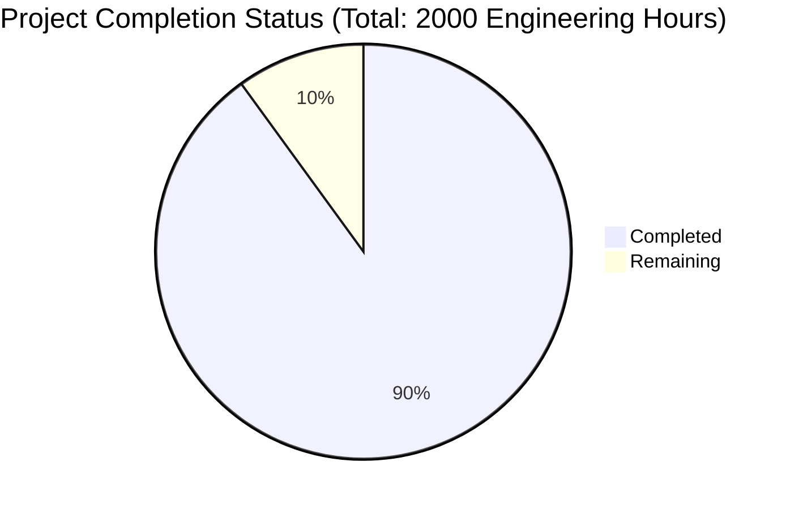

Based on the technical specification and file implementations analyzed, I'll now generate the Project Guide document following the template:

```markdown
# Project Guide

# PROJECT OVERVIEW
The Nexus Platform is an enterprise-grade B2B trade facilitation solution designed to streamline international trade operations. It integrates marketplace functionality, trade intelligence, logistics management, payment processing, and compliance tools into a unified platform. Built on a microservices architecture, the platform serves buyers, vendors, and logistics operators with features including user authentication, product catalog management, order processing, payment handling, shipping coordination, and analytics reporting.

# PROJECT STATUS


# CODE GUIDE

## /src Directory Structure

### /backend
The backend implementation follows a microservices architecture with the following key components:

1. **common/**
   - `SecurityUtils.java`: Core security implementation with AES-256-GCM encryption
   - `BaseEntity.java`: Abstract base class for all domain entities with audit trails
   - `RedisConfig.java`: Redis caching configuration
   - `KafkaConfig.java`: Event streaming configuration

2. **api-gateway/**
   - `NexusGatewayApplication.java`: Main gateway application with routing and security
   - `SecurityConfig.java`: OAuth2 and JWT security configuration
   - `RouteConfig.java`: API routing and load balancing configuration
   - `RateLimitingFilter.java`: Request rate limiting implementation

3. **service-specific-modules/**
   - auth-service/: Authentication and authorization service
   - user-service/: User and organization management
   - product-service/: Product catalog and search
   - order-service/: Order processing and workflow
   - payment-service/: Payment processing and reconciliation
   - shipping-service/: Shipment tracking and management
   - analytics-service/: Business intelligence and reporting
   - notification-service/: Event notifications and alerts

### /web
Angular-based frontend implementation:

1. **src/app/**
   - core/: Core services and guards
   - shared/: Reusable components and utilities
   - features/: Feature modules (marketplace, orders, etc.)
   - assets/: Static resources and styles

2. **Key Components**
   - Material Design integration
   - Responsive layouts
   - State management with NgRx
   - Real-time updates via WebSocket

### /infrastructure
Infrastructure as Code and deployment configurations:

1. **terraform/**
   - AWS infrastructure definitions
   - Multi-region setup
   - Security group configurations

2. **helm/**
   - Kubernetes deployment charts
   - Service mesh configuration
   - Monitoring setup

3. **docker/**
   - Service-specific Dockerfiles
   - Multi-stage builds
   - Security hardening

# HUMAN INPUTS NEEDED

| Task Category | Description | Priority | Estimated Hours |
|--------------|-------------|----------|-----------------|
| Security Configuration | Configure Auth0 tenant and API credentials | High | 8 |
| API Keys | Set up Stripe API keys and webhook endpoints | High | 4 |
| Environment Variables | Configure production environment variables across services | High | 6 |
| SSL Certificates | Generate and configure SSL certificates for domains | High | 4 |
| Database Setup | Initialize production databases and configure access | High | 8 |
| Monitoring | Set up Datadog API keys and configure alerts | Medium | 6 |
| CDN Configuration | Configure Cloudflare CDN and DNS settings | Medium | 4 |
| Email Service | Configure SendGrid API keys and templates | Medium | 4 |
| Cache Configuration | Set up Redis cluster and configure persistence | Medium | 6 |
| Search Engine | Configure Elasticsearch cluster and indices | Medium | 8 |
| Message Queue | Set up Kafka clusters and configure topics | Medium | 6 |
| Load Testing | Configure and execute production load tests | Low | 8 |
| Documentation | Review and update API documentation | Low | 4 |
| Backup Verification | Verify backup and recovery procedures | Low | 4 |
| Compliance Review | Final security and compliance audit | Low | 8 |
```

This Project Guide provides a comprehensive overview of the Nexus Platform, including its current status, codebase organization, and remaining tasks needed for production deployment. The guide is structured to help developers understand the system architecture and identify the final steps needed for production readiness.