# Technical Specifications

# 1. INTRODUCTION

## 1.1 EXECUTIVE SUMMARY

The Nexus Platform represents a comprehensive B2B trade facilitation solution designed to streamline and digitize international trade operations. By integrating marketplace functionality, trade intelligence, logistics management, payment processing, and compliance tools into a unified platform, Nexus addresses the fundamental challenges of fragmented trade processes and lack of digital integration in global commerce.

The platform serves three primary stakeholder groups: buyers seeking efficient procurement channels, vendors expanding market reach, and logistics operators managing shipments. Through its microservices architecture and standards-based approach, Nexus aims to reduce operational complexity, enhance supply chain visibility, and enable data-driven decision making across the trade ecosystem.

## 1.2 SYSTEM OVERVIEW

### Project Context

| Aspect | Description |
|--------|-------------|
| Market Position | Enterprise-grade B2B trade platform targeting medium to large organizations |
| Industry Focus | Cross-industry with emphasis on manufacturing, wholesale, and distribution |
| Competitive Edge | Standards-based integration (eCl@ss, GS1, EDIFACT) with AI-powered insights |
| Enterprise Integration | Seamless connectivity with ERP, WMS, and financial systems through standardized APIs |

### High-Level Description

| Component | Capabilities |
|-----------|-------------|
| Marketplace Module | - User profile management<br>- Product/vendor discovery<br>- Digital catalog management<br>- Order processing |
| Trade Intelligence | - Market analytics dashboard<br>- AI-powered forecasting<br>- Performance metrics |
| Shipping Module | - Multi-carrier integration<br>- Real-time tracking<br>- Documentation management |
| Payment Services | - Multi-currency processing<br>- Escrow services<br>- Compliance handling |
| Contract Management | - Digital contract workflows<br>- Compliance automation<br>- Dispute resolution |

### Success Criteria

| Category | Metrics |
|----------|---------|
| Platform Performance | - 99.9% system availability<br>- Sub-500ms API response time<br>- 100,000 concurrent users support |
| Business Metrics | - Transaction volume growth<br>- User acquisition rate<br>- Processing cost reduction |
| Technical Goals | - Successful third-party integrations<br>- Security compliance achievements<br>- API adoption rates |

## 1.3 SCOPE

### In-Scope Elements

| Category | Components |
|----------|------------|
| Core Features | - User authentication and authorization<br>- Product catalog management<br>- Order processing workflow<br>- Payment processing<br>- Shipping coordination<br>- Analytics and reporting |
| Technical Implementation | - Microservices architecture<br>- Cloud infrastructure<br>- API gateway<br>- Event-driven processing<br>- Data storage and analytics |
| Standards Support | - eCl@ss product classification<br>- GS1 identification<br>- EDIFACT message processing<br>- BMEcat catalog format |
| Security & Compliance | - GDPR/CCPA compliance<br>- PCI DSS certification<br>- ISO 27001 alignment |

### Out-of-Scope Elements

| Category | Exclusions |
|----------|------------|
| Features | - Physical logistics operations<br>- Banking services beyond payments<br>- Custom hardware solutions<br>- Legacy system migration services |
| Technical | - On-premises deployment options<br>- Non-standard protocol support<br>- Custom hardware interfaces<br>- Offline processing capabilities |
| Geographic | - Regions under trade sanctions<br>- Markets requiring local data centers<br>- Non-supported regulatory frameworks |
| Integration | - Non-standard ERP systems<br>- Legacy EDI formats<br>- Custom payment gateways<br>- Proprietary logistics systems |

# 2. SYSTEM ARCHITECTURE

## 2.1 High-Level Architecture

```mermaid
graph TB
    subgraph External Systems
        ERP[ERP Systems]
        LOG[Logistics Providers]
        PAY[Payment Gateways]
        EDI[EDI Partners]
    end

    subgraph Client Layer
        WEB[Web Interface]
        MOB[Mobile Apps]
        API[API Clients]
    end

    subgraph Gateway Layer
        LB[Load Balancer]
        WAF[Web Application Firewall]
        APIG[API Gateway]
    end

    subgraph Service Layer
        subgraph Core Services
            USR[User Service]
            PRD[Product Service]
            ORD[Order Service]
            PAY_S[Payment Service]
            SHP[Shipping Service]
        end

        subgraph Support Services
            AUTH[Auth Service]
            NOTIF[Notification Service]
            ANLYT[Analytics Service]
        end
    end

    subgraph Data Layer
        PSQL[(PostgreSQL)]
        MONGO[(MongoDB)]
        REDIS[(Redis Cache)]
        ES[(Elasticsearch)]
        KAFKA[Kafka Event Bus]
    end

    WEB & MOB & API --> LB
    LB --> WAF
    WAF --> APIG

    APIG --> Core Services
    APIG --> Support Services

    Core Services --> KAFKA
    Core Services --> PSQL & MONGO
    Support Services --> REDIS & ES

    Core Services <--> ERP & LOG & PAY & EDI
```

## 2.2 Component Details

### 2.2.1 Core Components

```mermaid
graph TB
    subgraph "User Service"
        US[User Management]
        PROF[Profile Handler]
        ORG[Organization Manager]
    end

    subgraph "Product Service"
        CAT[Catalog Manager]
        SRCH[Search Engine]
        CLASS[Classification Handler]
    end

    subgraph "Order Service"
        OMS[Order Management]
        WF[Workflow Engine]
        DOC[Document Handler]
    end

    subgraph "Payment Service"
        PG[Payment Gateway]
        ESC[Escrow Handler]
        REC[Reconciliation]
    end

    subgraph "Shipping Service"
        SHP[Shipment Manager]
        TRK[Tracking Engine]
        RT[Route Optimizer]
    end

    US --> KAFKA[Event Bus]
    CAT --> KAFKA
    OMS --> KAFKA
    PG --> KAFKA
    SHP --> KAFKA
```

## 2.3 Technical Decisions

### 2.3.1 Architecture Pattern

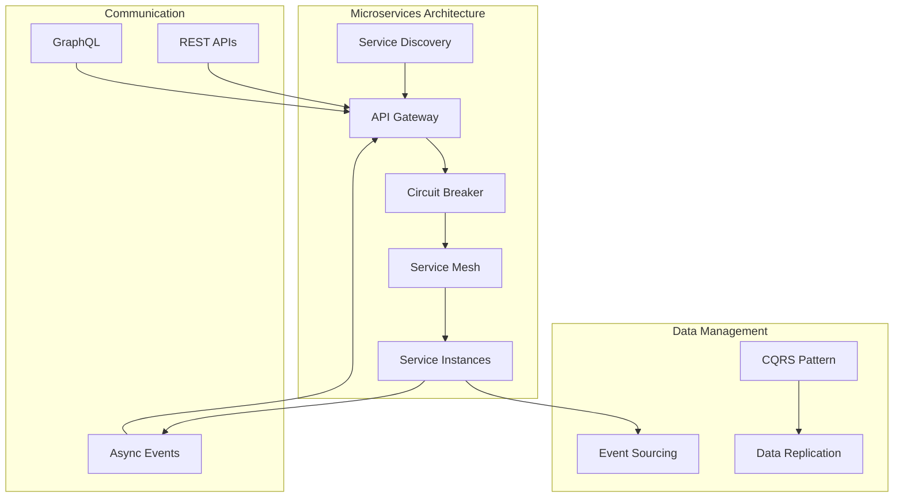

## 2.4 Cross-Cutting Concerns

### 2.4.1 Observability Architecture

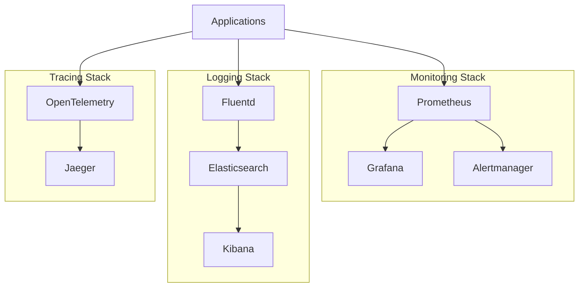

### 2.4.2 Security Architecture

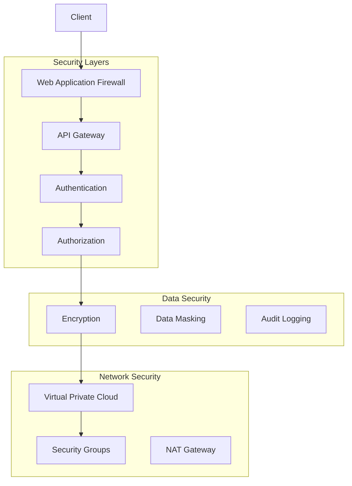

## 2.5 Deployment Architecture

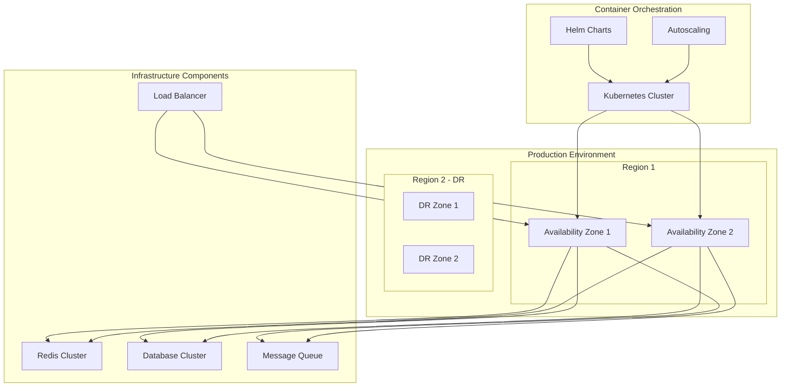

## 2.6 Data Flow Architecture

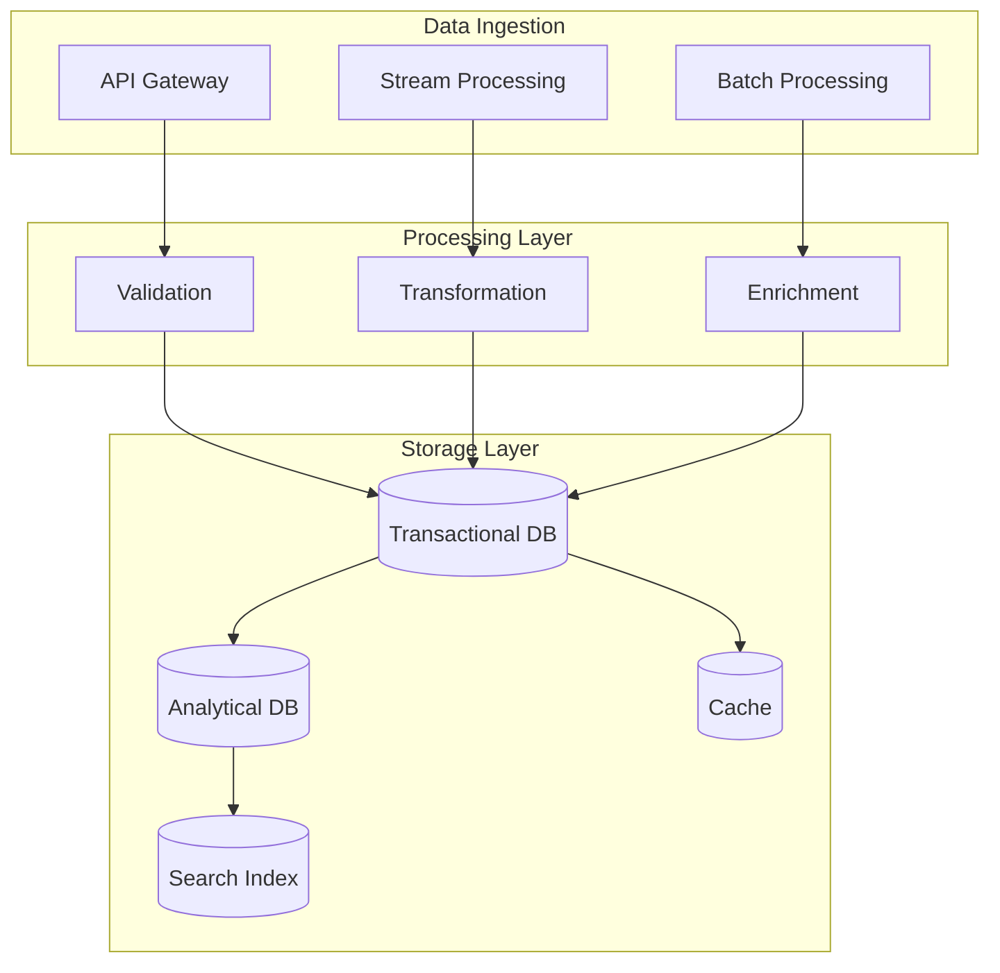

## 2.7 Integration Architecture

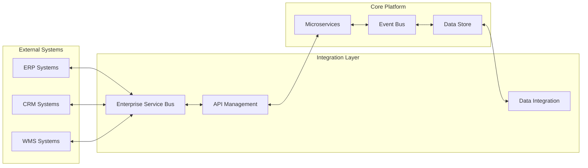

# 3. SYSTEM COMPONENTS ARCHITECTURE

## 3.1 USER INTERFACE DESIGN

### 3.1.1 Design System Specifications

| Component | Specification | Implementation Details |
|-----------|--------------|----------------------|
| Typography | Hierarchical scale | - Primary: Roboto<br>- Secondary: Open Sans<br>- Scale: 12/14/16/20/24/32px |
| Color System | Accessible palette | - Primary: #1976D2<br>- Secondary: #424242<br>- Error: #D32F2F<br>- WCAG AA compliant contrast |
| Layout Grid | 12-column system | - Breakpoints: 320/768/1024/1440px<br>- Margins: 16/24/32/48px<br>- Gutters: 16/24px |
| Components | Material Design based | - Custom theme implementation<br>- Consistent spacing system<br>- Standardized interactions |

### 3.1.2 Responsive Design Requirements

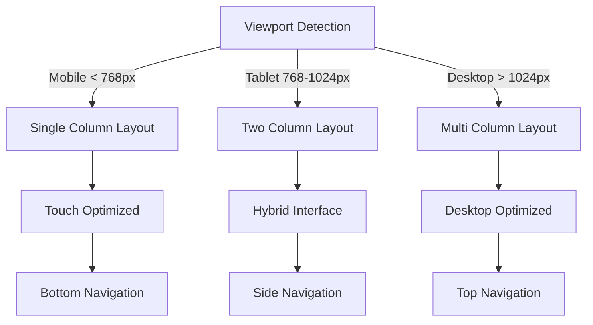

### 3.1.3 Critical User Flows

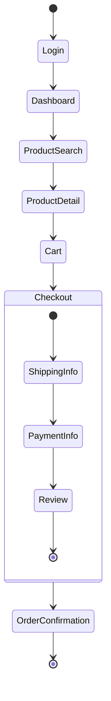

## 3.2 DATABASE DESIGN

### 3.2.1 Schema Design

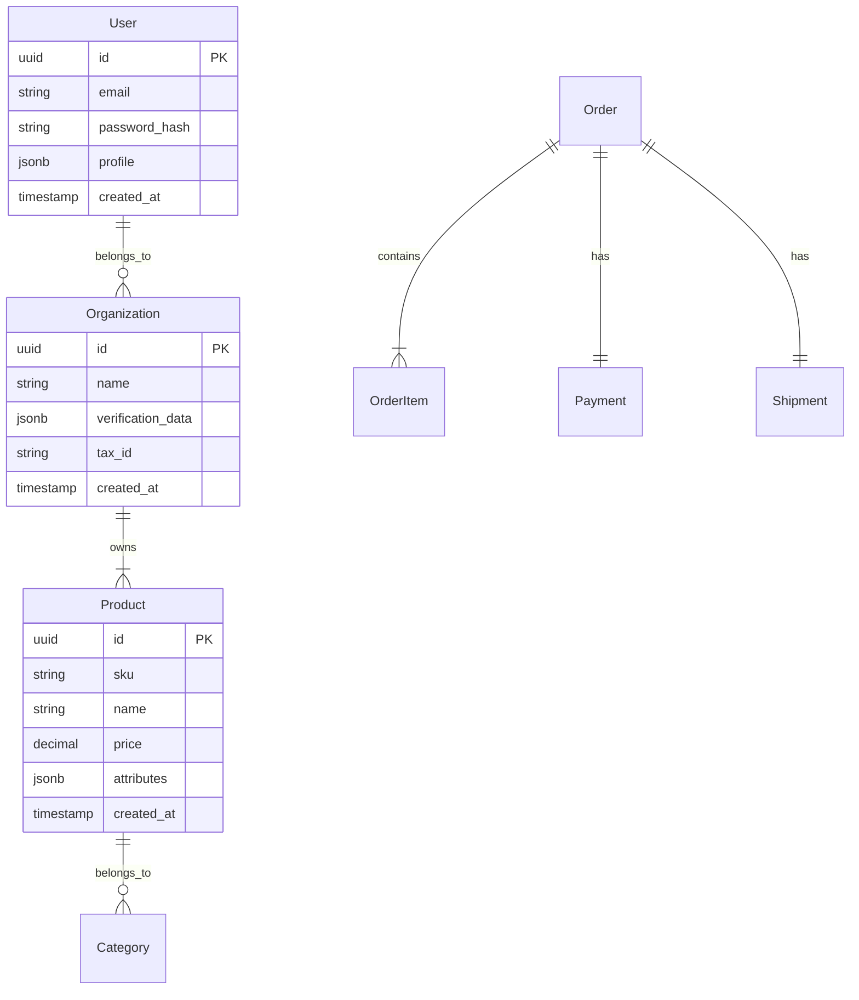

### 3.2.2 Data Management Strategy

| Aspect | Strategy | Implementation |
|--------|----------|----------------|
| Partitioning | Time-based | - Monthly partitions for transactions<br>- Regional partitions for user data |
| Indexing | Multi-level | - B-tree for primary keys<br>- GiST for geographic data<br>- Full-text search for products |
| Caching | Hierarchical | - L1: Application cache (Redis)<br>- L2: Database cache<br>- L3: CDN for static content |
| Replication | Multi-region | - Primary-Secondary setup<br>- Read replicas per region<br>- Async replication |

## 3.3 API DESIGN

### 3.3.1 API Architecture

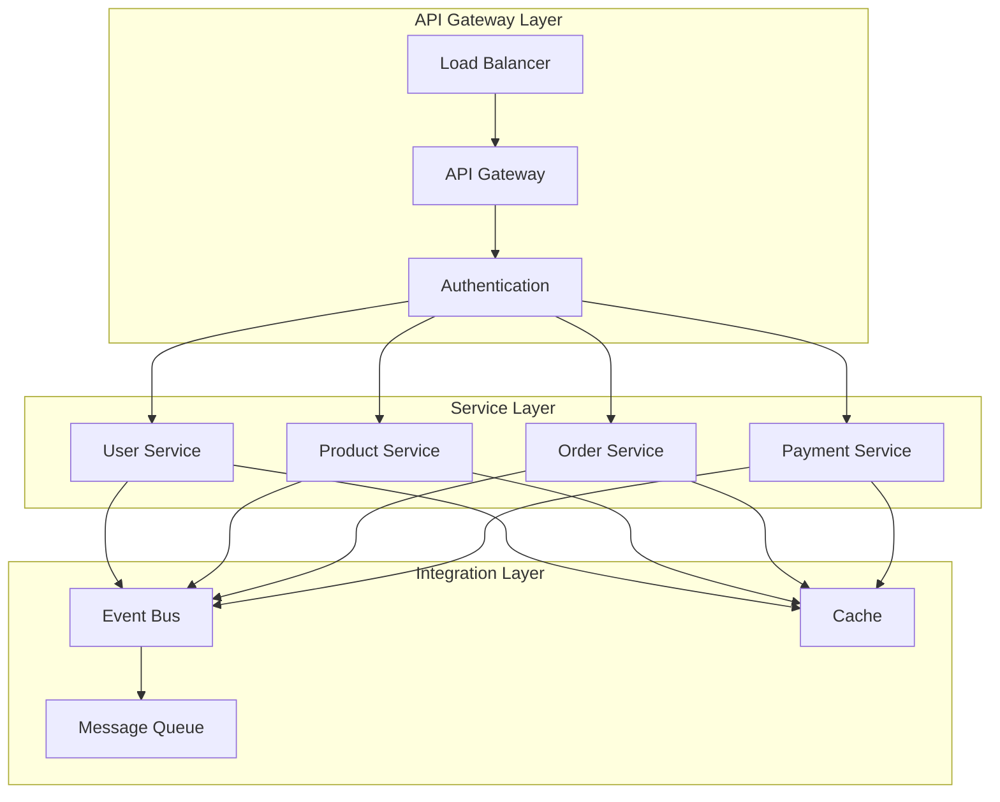

### 3.3.2 API Specifications

| Endpoint Category | Authentication | Rate Limit | Cache Policy |
|------------------|----------------|------------|--------------|
| Public APIs | API Key | 1000/hour | 5 minutes |
| Partner APIs | OAuth 2.0 + JWT | 5000/hour | 1 minute |
| Internal APIs | mTLS | 50000/hour | No cache |
| Admin APIs | OAuth 2.0 + 2FA | 1000/hour | No cache |

### 3.3.3 Integration Patterns

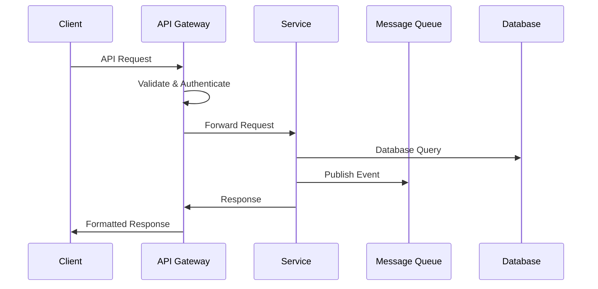

### 3.3.4 Error Handling

| Error Category | HTTP Status | Response Format | Retry Strategy |
|----------------|-------------|-----------------|----------------|
| Validation | 400 | `{"error": "validation", "details": [...]}` | None |
| Authentication | 401/403 | `{"error": "auth", "message": "..."}` | None |
| Resource | 404 | `{"error": "not_found", "resource": "..."}` | None |
| Rate Limit | 429 | `{"error": "rate_limit", "retry_after": 123}` | Exponential backoff |
| Server | 500 | `{"error": "internal", "id": "..."}` | Circuit breaker |

# 4. TECHNOLOGY STACK

## 4.1 PROGRAMMING LANGUAGES

| Platform | Language | Version | Justification |
|----------|----------|---------|---------------|
| Backend Services | Java | 17 LTS | - Enterprise-grade performance<br>- Strong typing for complex domain models<br>- Extensive B2B integration libraries<br>- Native support for eCl@ss/EDIFACT |
| Frontend Web | TypeScript | 4.9+ | - Type safety for large-scale applications<br>- Enhanced IDE support<br>- Better maintainability for complex UI |
| Data Processing | Python | 3.11+ | - Rich ecosystem for AI/ML<br>- Efficient data processing libraries<br>- Strong integration capabilities |
| DevOps Scripts | Go | 1.20+ | - Fast execution for CI/CD tasks<br>- Native cross-compilation<br>- Excellent cloud SDK support |

## 4.2 FRAMEWORKS & LIBRARIES

### Backend Frameworks

| Component | Framework | Version | Purpose |
|-----------|-----------|---------|----------|
| Core Services | Spring Boot | 3.1.x | - Production-ready features<br>- Microservices support<br>- Enterprise integration patterns |
| API Gateway | Spring Cloud Gateway | 4.0.x | - Dynamic routing<br>- Circuit breaking<br>- Rate limiting |
| Security | Spring Security | 6.1.x | - OAuth2/OIDC support<br>- RBAC implementation<br>- Security best practices |
| GraphQL | Spring GraphQL | 1.2.x | - Schema-first development<br>- Integration with Spring ecosystem |

### Frontend Frameworks

| Component | Framework | Version | Purpose |
|-----------|-----------|---------|----------|
| Web Application | Angular | 16.x | - Enterprise-grade framework<br>- Strong typing support<br>- Comprehensive component library |
| UI Components | Angular Material | 16.x | - Consistent design system<br>- Accessibility support<br>- Responsive layouts |
| State Management | NgRx | 16.x | - Predictable state management<br>- Side effect handling<br>- Developer tools |

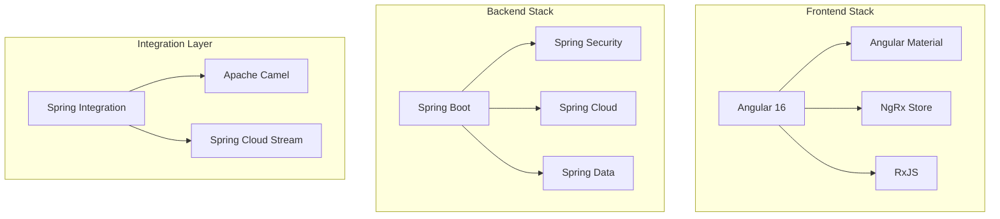

## 4.3 DATABASES & STORAGE

| Type | Technology | Version | Usage |
|------|------------|---------|--------|
| Primary RDBMS | PostgreSQL | 15.x | - Transactional data<br>- User management<br>- Order processing |
| Document Store | MongoDB | 6.0.x | - Product catalogs<br>- Unstructured content<br>- Analytics data |
| Cache | Redis | 7.0.x | - Session management<br>- API caching<br>- Real-time data |
| Search Engine | Elasticsearch | 8.8.x | - Full-text search<br>- Analytics<br>- Log aggregation |
| Message Queue | Apache Kafka | 3.4.x | - Event streaming<br>- System integration<br>- Real-time processing |

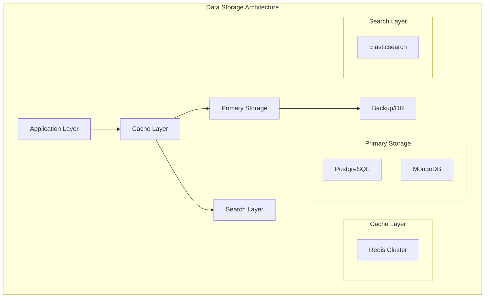

## 4.4 THIRD-PARTY SERVICES

| Category | Service | Purpose | Integration Method |
|----------|---------|---------|-------------------|
| Authentication | Auth0 | - Identity management<br>- SSO implementation<br>- MFA support | OAuth2/OIDC |
| Payment Processing | Stripe | - Payment processing<br>- Subscription management<br>- Invoice generation | REST API |
| Email Service | SendGrid | - Transactional emails<br>- Marketing communications<br>- Email templates | SMTP/API |
| CDN | Cloudflare | - Content delivery<br>- DDoS protection<br>- SSL/TLS | DNS/API |
| Monitoring | Datadog | - Application monitoring<br>- Log management<br>- APM | Agent/API |

## 4.5 DEVELOPMENT & DEPLOYMENT

### Development Tools

| Category | Tool | Version | Purpose |
|----------|------|---------|----------|
| IDE | IntelliJ IDEA | 2023.2 | Java/TypeScript development |
| API Testing | Postman | Latest | API development and testing |
| Version Control | Git | 2.40+ | Source code management |
| Code Quality | SonarQube | 9.9 LTS | Code analysis and quality gates |

### Deployment Pipeline

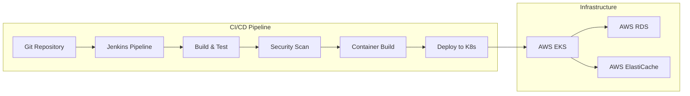

### Infrastructure Components

| Component | Technology | Version | Purpose |
|-----------|------------|---------|----------|
| Container Runtime | Docker | 24.x | Application containerization |
| Orchestration | Kubernetes | 1.27+ | Container orchestration |
| Service Mesh | Istio | 1.18+ | Microservices networking |
| Infrastructure as Code | Terraform | 1.5+ | Infrastructure provisioning |
| Secrets Management | HashiCorp Vault | 1.13+ | Secrets and key management |

# 5. SYSTEM DESIGN

## 5.1 USER INTERFACE DESIGN

### 5.1.1 Layout Structure

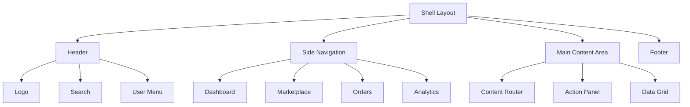

### 5.1.2 Key Interface Components

| Component | Purpose | Key Features |
|-----------|---------|--------------|
| Product Catalog | Display and search products | - Grid/List view toggle<br>- Advanced filters<br>- Quick actions menu |
| Order Dashboard | Manage trade operations | - Status timeline<br>- Document viewer<br>- Action buttons |
| Analytics Panel | Display trade insights | - Interactive charts<br>- Custom date ranges<br>- Export options |

### 5.1.3 Responsive Breakpoints

| Breakpoint | Width | Layout Adjustments |
|------------|-------|-------------------|
| Mobile | < 768px | - Stack navigation<br>- Full-width grids<br>- Collapsed menus |
| Tablet | 768px - 1024px | - Side nav overlay<br>- 2-column grids<br>- Compact menus |
| Desktop | > 1024px | - Persistent side nav<br>- Multi-column layout<br>- Expanded features |

## 5.2 DATABASE DESIGN

### 5.2.1 Schema Architecture


### 5.2.2 Storage Strategy

| Data Type | Storage Solution | Justification |
|-----------|-----------------|---------------|
| Transactional | PostgreSQL | ACID compliance, complex queries |
| Document | MongoDB | Flexible schema, catalog storage |
| Cache | Redis | High performance, distributed cache |
| Search | Elasticsearch | Full-text search, analytics |
| Events | Kafka | Stream processing, event sourcing |

### 5.2.3 Data Partitioning

| Entity | Partition Strategy | Retention Policy |
|--------|-------------------|------------------|
| Orders | Time-based monthly | 7 years |
| Products | Category-based | Active lifetime |
| Analytics | Time-based daily | 2 years |
| Audit Logs | Time-based weekly | 5 years |

## 5.3 API DESIGN

### 5.3.1 API Architecture

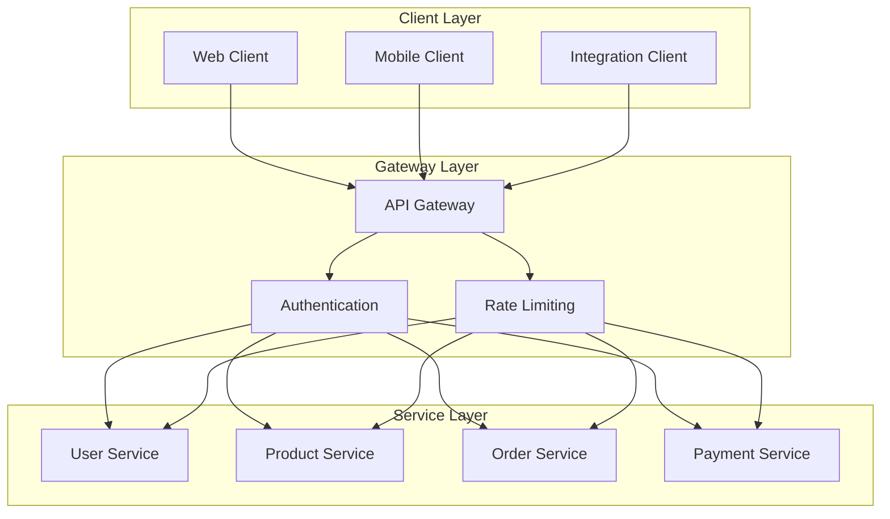

### 5.3.2 API Endpoints

| Category | Method | Endpoint | Purpose |
|----------|--------|----------|---------|
| Products | GET | /api/v1/products | List products with pagination |
| Products | POST | /api/v1/products | Create new product |
| Orders | GET | /api/v1/orders | List orders with filters |
| Orders | POST | /api/v1/orders | Create new order |
| Payments | POST | /api/v1/payments | Process payment |

### 5.3.3 Integration Patterns


### 5.3.4 API Security

| Security Layer | Implementation | Purpose |
|----------------|----------------|---------|
| Authentication | OAuth 2.0 + JWT | Identity verification |
| Authorization | RBAC | Access control |
| Transport | TLS 1.3 | Data encryption |
| Rate Limiting | Token bucket | Abuse prevention |
| Validation | JSON Schema | Input validation |

## 6. USER INTERFACE DESIGN

### 6.1 Design System

| Component | Specification | Implementation |
|-----------|--------------|----------------|
| Typography | Roboto, Open Sans | Primary: 16px, Headers: 24/32px |
| Colors | Material Design | Primary: #1976D2, Secondary: #424242 |
| Grid | 12-column system | Breakpoints: 320/768/1024/1440px |
| Spacing | 8px base unit | Margins: 16/24/32px |

### 6.2 Core Interface Wireframes

#### 6.2.1 Dashboard Layout
```
+----------------------------------------------------------+
|  [#] Nexus Platform                [@] Admin  [=] Settings |
+------------------+-----------------------------------+-----+
|                  |                                   |     |
| [#] Dashboard    | Welcome back, John Smith          |     |
| [$] Orders       | Quick Actions:                    |     |
| [@] Products     | [+] New Order  [^] Import Products|     |
| [!] Shipments    |                                  |     |
| [*] Analytics    | Recent Activity                  |     |
|                  | +--------------------------------+     |
|                  | | Order #12345 - Processing      |     |
|                  | | Shipment #789 - In Transit     |     |
|                  | | New Product Added - SKU789     |     |
|                  | +--------------------------------+     |
+------------------+-----------------------------------+-----+
```

#### 6.2.2 Product Catalog
```
+----------------------------------------------------------+
| Products > Catalog                          [+] Add Product|
+----------------------------------------------------------+
| Search: [...........................] [Search]             |
|                                                           |
| Filters:                                                  |
| Category: [v] All Categories                              |
| Price Range: [...] to [...]                              |
| Status: ( ) Active ( ) Inactive ( ) All                   |
|                                                           |
| +----------------+ +----------------+ +----------------+   |
| | Product A      | | Product B      | | Product C      |   |
| | $199.99        | | $299.99        | | $159.99        |   |
| | SKU: ABC123    | | SKU: DEF456    | | SKU: GHI789    |   |
| | [View Details] | | [View Details] | | [View Details] |   |
| +----------------+ +----------------+ +----------------+   |
+----------------------------------------------------------+
```

#### 6.2.3 Order Processing
```
+----------------------------------------------------------+
| New Order                                                 |
+----------------------------------------------------------+
| 1. Select Products > 2. Shipping > 3. Payment > 4. Review |
| [====================================-------------] 70%    |
+----------------------------------------------------------+
| Selected Products:                                        |
| [ ] Product A - $199.99 - Qty: [2]                       |
| [ ] Product B - $299.99 - Qty: [1]                       |
|                                                          |
| Shipping Details:                                        |
| Address: [..........................................]     |
| Method:  ( ) Standard  ( ) Express  ( ) Priority         |
|                                                          |
| [<] Back                                    [Next >]     |
+----------------------------------------------------------+
```

### 6.3 Component Key

```
Icons:
[#] - Menu/Dashboard
[$] - Financial/Payments
[i] - Information
[+] - Add/Create
[x] - Close/Delete
[<] [>] - Navigation
[^] - Upload
[@] - User/Profile
[!] - Alerts
[=] - Settings
[*] - Favorites

Input Elements:
[...] - Text input field
[ ] - Checkbox
( ) - Radio button
[v] - Dropdown menu
[Button] - Clickable button
[====] - Progress bar

Navigation:
+--+ - Container borders
|  | - Vertical separators
+-- - Hierarchical structure
```

### 6.4 Responsive Behavior

| Breakpoint | Layout Adjustments |
|------------|-------------------|
| Mobile (<768px) | - Stack navigation vertically<br>- Full-width components<br>- Collapsed menu |
| Tablet (768-1024px) | - Side navigation overlay<br>- 2-column grid<br>- Condensed header |
| Desktop (>1024px) | - Persistent side navigation<br>- 3-column grid<br>- Expanded header |

### 6.5 Interaction Patterns

| Pattern | Implementation |
|---------|---------------|
| Form Validation | - Real-time field validation<br>- Error messages below fields<br>- Submit button state management |
| Data Loading | - Skeleton screens<br>- Progressive loading<br>- Infinite scroll for lists |
| Navigation | - Breadcrumb trails<br>- Back/Forward support<br>- Deep linking |
| Notifications | - Toast messages<br>- Status indicators<br>- Progress feedback |

# 7. SECURITY CONSIDERATIONS

## 7.1 AUTHENTICATION AND AUTHORIZATION

### 7.1.1 Authentication Strategy

| Authentication Method | Use Case | Implementation |
|----------------------|-----------|----------------|
| OAuth 2.0 + OIDC | Primary user authentication | - Authorization code flow with PKCE<br>- JWT tokens<br>- Refresh token rotation |
| API Keys | B2B integrations | - HMAC-based keys<br>- Rate limiting per key<br>- Automatic key rotation |
| mTLS | Service-to-service | - X.509 certificates<br>- Automated cert management<br>- Certificate rotation |
| Multi-Factor Auth | High-risk operations | - Time-based OTP<br>- Hardware security keys<br>- Biometric verification |

### 7.1.2 Authorization Framework

```mermaid
flowchart TD
    A[Request] --> B{Authentication}
    B -->|Valid| C{Authorization}
    B -->|Invalid| D[401 Unauthorized]
    C -->|Permitted| E[Access Granted]
    C -->|Denied| F[403 Forbidden]
    
    subgraph "RBAC System"
    G[Roles] --> H[Permissions]
    H --> I[Resources]
    end
    
    C --> G
```

### 7.1.3 Role-Based Access Control Matrix

| Role | Marketplace | Orders | Payments | Analytics | Admin |
|------|------------|--------|----------|-----------|--------|
| Buyer | Read | Create/Read | Create/Read | Self Only | None |
| Vendor | Create/Read | Read/Update | Read | Self Only | None |
| Logistics | Read | Read/Update | None | Operations | None |
| Admin | Full | Full | Full | Full | Full |

## 7.2 DATA SECURITY

### 7.2.1 Encryption Strategy

| Data State | Method | Key Management |
|------------|--------|----------------|
| At Rest | AES-256-GCM | AWS KMS |
| In Transit | TLS 1.3 | Automated cert management |
| In Processing | Format-preserving encryption | Hardware security modules |
| Backups | AES-256-CBC | Offline master keys |

### 7.2.2 Data Classification

```mermaid
graph TD
    subgraph "Data Classification Levels"
        A[Public] --> B[Internal]
        B --> C[Confidential]
        C --> D[Restricted]
    end
    
    subgraph "Security Controls"
        E[Encryption]
        F[Access Controls]
        G[Audit Logging]
        H[Data Masking]
    end
    
    D --> E & F & G & H
    C --> E & F & G
    B --> F & G
    A --> G
```

### 7.2.3 PII Protection

| Data Type | Protection Method | Access Control |
|-----------|------------------|----------------|
| Personal Information | Field-level encryption | Role-based access |
| Payment Data | PCI DSS compliant tokenization | Strict need-to-know |
| Trade Secrets | Database encryption | Multi-factor auth |
| Documents | Object-level encryption | Document-level permissions |

## 7.3 SECURITY PROTOCOLS

### 7.3.1 Security Architecture

```mermaid
flowchart TD
    subgraph "Security Layers"
        A[WAF] --> B[API Gateway]
        B --> C[Authentication]
        C --> D[Authorization]
        D --> E[Service Mesh]
    end
    
    subgraph "Security Controls"
        F[DDoS Protection]
        G[Rate Limiting]
        H[Input Validation]
        I[Audit Logging]
    end
    
    A --> F & G
    B --> G & H
    C --> I
    D --> I
```

### 7.3.2 Security Monitoring

| Component | Monitoring Method | Alert Threshold |
|-----------|------------------|-----------------|
| WAF | Real-time threat detection | Any blocked request |
| Authentication | Failed login attempts | 5 failures/minute |
| API Gateway | Request rate monitoring | 1000 req/min/IP |
| Data Access | Suspicious pattern detection | Unusual access patterns |

### 7.3.3 Security Compliance Requirements

| Standard | Requirements | Implementation |
|----------|--------------|----------------|
| PCI DSS | Payment data security | - Tokenization<br>- Encryption<br>- Access logging |
| GDPR | Data privacy | - Consent management<br>- Data minimization<br>- Right to erasure |
| ISO 27001 | Information security | - Risk assessment<br>- Security controls<br>- Incident management |
| SOC 2 | Service organization controls | - Security policies<br>- Access controls<br>- Monitoring |

### 7.3.4 Incident Response

```mermaid
stateDiagram-v2
    [*] --> Detection
    Detection --> Analysis
    Analysis --> Containment
    Containment --> Eradication
    Eradication --> Recovery
    Recovery --> PostIncident
    PostIncident --> [*]
    
    state PostIncident {
        [*] --> Review
        Review --> Update
        Update --> Documentation
        Documentation --> [*]
    }
```

# 8. INFRASTRUCTURE

## 8.1 DEPLOYMENT ENVIRONMENT

### 8.1.1 Environment Strategy

| Environment | Purpose | Configuration |
|------------|---------|---------------|
| Development | Feature development, unit testing | Single region, minimal redundancy |
| Staging | Integration testing, UAT | Multi-AZ, production-like setup |
| Production | Live system operation | Multi-region, full redundancy |
| DR | Disaster recovery | Standby environment in alternate region |

### 8.1.2 Production Architecture

```mermaid
graph TB
    subgraph "Primary Region"
        LB1[Load Balancer]
        subgraph "AZ-1"
            APP1[Application Cluster]
            DB1[(Database Primary)]
        end
        subgraph "AZ-2"
            APP2[Application Cluster]
            DB2[(Database Replica)]
        end
    end

    subgraph "DR Region"
        LB2[Load Balancer]
        subgraph "DR-AZ-1"
            APP3[Application Cluster]
            DB3[(Database Replica)]
        end
    end

    CDN[CloudFront CDN] --> LB1 & LB2
    LB1 --> APP1 & APP2
    LB2 --> APP3
    DB1 --> DB2
    DB1 --> DB3
```

## 8.2 CLOUD SERVICES

### 8.2.1 AWS Service Selection

| Service | Usage | Justification |
|---------|-------|--------------|
| EKS | Container orchestration | Native Kubernetes support, managed control plane |
| RDS | Database hosting | Managed PostgreSQL, automated backups |
| ElastiCache | Redis caching | Managed Redis, multi-AZ support |
| S3 | Object storage | Scalable storage for documents and backups |
| CloudFront | CDN | Global content delivery, edge caching |
| Route53 | DNS management | Global DNS with health checking |
| KMS | Key management | Encryption key management, rotation |
| CloudWatch | Monitoring | Unified monitoring and alerting |

### 8.2.2 Multi-Region Architecture

```mermaid
graph TB
    subgraph "Global"
        R53[Route 53]
        CF[CloudFront]
    end

    subgraph "US Region"
        EKS1[EKS Cluster]
        RDS1[(RDS Primary)]
        EC1[ElastiCache]
        S31[S3 Bucket]
    end

    subgraph "EU Region"
        EKS2[EKS Cluster]
        RDS2[(RDS Replica)]
        EC2[ElastiCache]
        S32[S3 Bucket]
    end

    R53 --> CF
    CF --> EKS1 & EKS2
    RDS1 --> RDS2
    S31 --> S32
```

## 8.3 CONTAINERIZATION

### 8.3.1 Container Strategy

| Component | Base Image | Configuration |
|-----------|------------|---------------|
| Java Services | Eclipse Temurin 17 | JVM tuning, G1GC |
| Angular Frontend | Node 18 Alpine | Nginx, compression |
| Python Services | Python 3.11 Slim | pip requirements |
| Support Services | Alpine Linux | Minimal footprint |

### 8.3.2 Container Security

```mermaid
flowchart TD
    A[Image Scanning] --> B{Security Gate}
    B -->|Pass| C[Registry Push]
    B -->|Fail| D[Security Review]
    C --> E[Deployment]
    
    subgraph "Security Controls"
        F[Vulnerability Scan]
        G[SBOM Generation]
        H[Policy Check]
    end
    
    A --> F & G & H
```

## 8.4 ORCHESTRATION

### 8.4.1 Kubernetes Configuration

| Component | Implementation | Purpose |
|-----------|---------------|----------|
| Ingress | NGINX Ingress Controller | Load balancing, TLS termination |
| Service Mesh | Istio | Traffic management, security |
| Monitoring | Prometheus + Grafana | Metrics collection, visualization |
| Secrets | External Secrets Operator | Secrets management with AWS SM |
| Storage | EBS CSI Driver | Persistent volume management |

### 8.4.2 Cluster Architecture

```mermaid
graph TB
    subgraph "EKS Cluster"
        subgraph "Control Plane"
            API[API Server]
            ETCD[(etcd)]
            CTRL[Controllers]
        end

        subgraph "Worker Nodes"
            subgraph "Node Pool 1"
                APP1[Application Pods]
                APP2[Application Pods]
            end
            subgraph "Node Pool 2"
                BATCH[Batch Jobs]
                QUEUE[Queue Workers]
            end
        end

        subgraph "Add-ons"
            MESH[Istio]
            PROM[Prometheus]
            CERT[Cert Manager]
        end
    end
```

## 8.5 CI/CD PIPELINE

### 8.5.1 Pipeline Stages

| Stage | Tools | Purpose |
|-------|-------|---------|
| Source Control | GitHub | Version control, code review |
| Build | Jenkins | Compilation, testing |
| Security Scan | SonarQube, Snyk | Code quality, vulnerabilities |
| Artifact Storage | ECR, S3 | Container images, assets |
| Deployment | ArgoCD | GitOps deployment |
| Validation | Selenium, k6 | Integration testing |

### 8.5.2 Pipeline Flow

```mermaid
flowchart LR
    A[Git Push] --> B[Jenkins Build]
    B --> C{Quality Gate}
    C -->|Pass| D[Container Build]
    C -->|Fail| E[Notify Team]
    D --> F[Security Scan]
    F --> G{Security Gate}
    G -->|Pass| H[Push to ECR]
    G -->|Fail| E
    H --> I[ArgoCD Sync]
    I --> J[Deploy to K8s]
    J --> K[Integration Tests]
    K -->|Pass| L[Production Release]
    K -->|Fail| M[Rollback]
```

### 8.5.3 Environment Promotion

| Environment | Promotion Criteria | Automation Level |
|-------------|-------------------|------------------|
| Development | Commit to feature branch | Automatic |
| Staging | PR merge to main | Automatic with approval |
| Production | Release tag | Manual approval required |
| DR | Production sync | Automatic replication |

# APPENDICES

## A. ADDITIONAL TECHNICAL INFORMATION

### A.1 Integration Standards Support

| Standard | Version | Implementation Details |
|----------|---------|----------------------|
| eCl@ss | 12.0 | - Product classification integration via REST API<br>- Daily catalog synchronization<br>- Automated mapping validation |
| GS1 | 3.4 | - GTIN product identification<br>- GLN location numbering<br>- SSCC container codes |
| EDIFACT | D.01B | - Message parsing and generation<br>- Automated compliance checking<br>- Error handling and reporting |
| BMEcat | 2.1 | - Catalog import/export<br>- Schema validation<br>- Version control |

### A.2 System Monitoring Matrix

```mermaid
flowchart TD
    subgraph "Monitoring Stack"
        A[Prometheus] --> B[Grafana]
        C[ELK Stack] --> B
        D[Jaeger] --> B
        E[Datadog] --> B
    end

    subgraph "Alert Channels"
        F[PagerDuty]
        G[Slack]
        H[Email]
    end

    B --> F & G & H
```

### A.3 Backup and Recovery Procedures

| Component | Backup Method | Recovery Time | Retention |
|-----------|--------------|---------------|-----------|
| PostgreSQL | WAL Archiving | < 15 minutes | 30 days |
| MongoDB | Replica Sets | < 30 minutes | 30 days |
| Redis | RDB + AOF | < 5 minutes | 7 days |
| File Storage | S3 Versioning | < 60 minutes | 365 days |
| Configurations | Git Repository | < 10 minutes | Indefinite |

## B. GLOSSARY

| Term | Definition |
|------|------------|
| Active-Active | A deployment model where multiple instances of an application run simultaneously |
| Circuit Breaker | A design pattern that prevents cascading failures in distributed systems |
| Event Sourcing | A pattern of storing data as a sequence of immutable events |
| Feature Flag | A technique to enable/disable functionality without deploying new code |
| Idempotency | Property where an operation produces the same result regardless of repetition |
| Message Queue | A component that temporarily stores messages between services |
| Service Mesh | Infrastructure layer that handles service-to-service communication |
| Webhook | HTTP callbacks that notify external systems about events |

## C. ACRONYMS

| Acronym | Full Form |
|---------|-----------|
| AMQP | Advanced Message Queuing Protocol |
| AOF | Append-Only File |
| ARIA | Accessible Rich Internet Applications |
| CSI | Container Storage Interface |
| GTIN | Global Trade Item Number |
| GLN | Global Location Number |
| HMAC | Hash-based Message Authentication Code |
| MQTT | Message Queuing Telemetry Transport |
| OIDC | OpenID Connect |
| PKCE | Proof Key for Code Exchange |
| RDB | Redis Database |
| SSCC | Serial Shipping Container Code |
| WAF | Web Application Firewall |
| WAL | Write-Ahead Logging |
| WSS | WebSocket Secure |
| XSD | XML Schema Definition |

## D. REFERENCES

### D.1 Technical Standards

```mermaid
mindmap
    root((Standards))
        Security
            PCI DSS
            ISO 27001
            GDPR
        Integration
            REST
            GraphQL
            gRPC
        Data
            JSON Schema
            Protocol Buffers
            AVRO
        Trade
            EDIFACT
            eCl@ss
            GS1
```

### D.2 Development Resources

| Category | Resource | URL |
|----------|----------|-----|
| API Design | OpenAPI Specification | https://swagger.io/specification/ |
| Authentication | OAuth 2.0 Specification | https://oauth.net/2/ |
| Cloud Services | AWS Documentation | https://docs.aws.amazon.com/ |
| Containerization | Kubernetes Documentation | https://kubernetes.io/docs/ |
| Messaging | Kafka Documentation | https://kafka.apache.org/documentation/ |