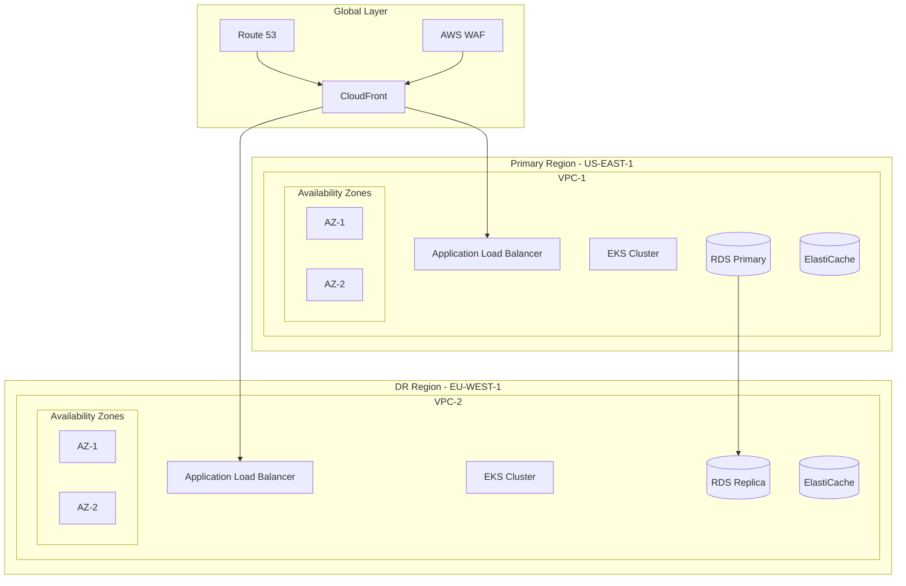
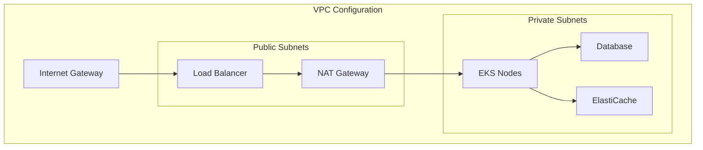
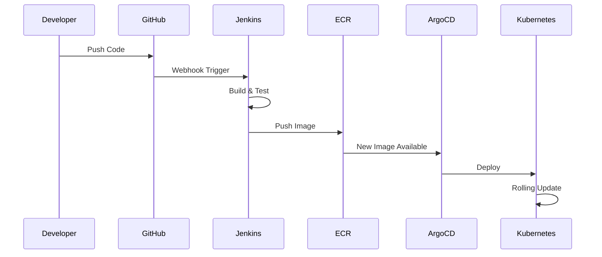
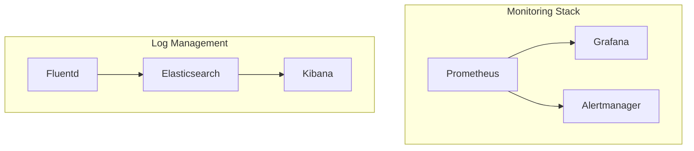
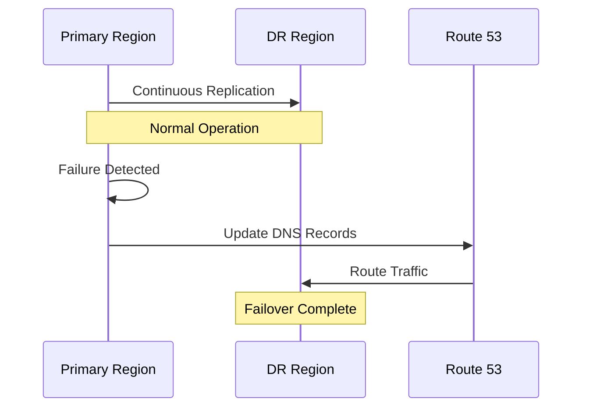

# Nexus Platform Infrastructure Documentation

## Table of Contents
- [Overview](#overview)
- [Prerequisites](#prerequisites)
- [Infrastructure Setup](#infrastructure-setup)
- [Application Deployment](#application-deployment)
- [Operations](#operations)

## Overview

### Architecture Overview


### Technology Stack
- **Infrastructure as Code**: Terraform v1.5+
- **Container Orchestration**: Kubernetes v1.27+, Helm v3.12+
- **Service Mesh**: Istio v1.18+
- **Monitoring**: Prometheus v2.45+, Grafana v9.5+
- **Logging**: ELK Stack v8.8+
- **CI/CD**: Jenkins v2.401+, ArgoCD v2.7+

### Repository Structure
```
infrastructure/
├── terraform/
│   ├── aws/
│   │   ├── provider.tf
│   │   ├── variables.tf
│   │   ├── networking.tf
│   │   └── security.tf
├── helm/
│   ├── nexus/
│   │   ├── Chart.yaml
│   │   ├── values.yaml
│   │   └── templates/
├── monitoring/
│   ├── prometheus.yaml
│   └── grafana.yaml
└── scripts/
    ├── backup.sh
    ├── scaling.sh
    └── dr.sh
```

### Security Framework
- AWS WAF protection
- Network isolation with VPC
- Pod security policies
- Secrets management with AWS Secrets Manager
- TLS encryption in transit
- Data encryption at rest

## Prerequisites

### AWS CLI Setup
```bash
aws configure
AWS Access Key ID: [YOUR_ACCESS_KEY]
AWS Secret Access Key: [YOUR_SECRET_KEY]
Default region name: us-east-1
```

### Required Tools
- AWS CLI v2.13+
- Terraform v1.5+
- kubectl v1.27+
- Helm v3.12+
- Docker v24+

### Security Credentials
- AWS IAM credentials with required permissions
- kubectl configuration
- Docker registry credentials
- SSL certificates

## Infrastructure Setup

### AWS Resources Provisioning
```bash
# Initialize Terraform
cd terraform/aws
terraform init

# Plan deployment
terraform plan -var-file="production.tfvars"

# Apply infrastructure
terraform apply -var-file="production.tfvars"
```

### Network Configuration


### Multi-Region Setup
1. Primary Region (US-EAST-1)
   - VPC with private/public subnets
   - EKS cluster with managed node groups
   - RDS primary instance
   - ElastiCache cluster

2. DR Region (EU-WEST-1)
   - Replicated VPC configuration
   - Standby EKS cluster
   - RDS read replica
   - Replicated ElastiCache

## Application Deployment

### Container Deployment Flow


### Monitoring Setup


## Operations

### Backup Procedures
- Database: Daily automated backups with 30-day retention
- Configuration: Git-based version control
- Application state: S3 bucket replication
- Execution: `./scripts/backup.sh`

### Scaling Guidelines
- Horizontal Pod Autoscaling (HPA)
- Node autoscaling based on cluster utilization
- RDS read replica scaling
- ElastiCache cluster scaling

### Disaster Recovery


RTO: < 15 minutes
RPO: < 5 minutes

### Troubleshooting Guide
1. Infrastructure Issues
   - Check AWS service health
   - Verify VPC connectivity
   - Validate security group rules

2. Application Issues
   - Review pod logs
   - Check service mesh status
   - Validate configuration maps

3. Performance Issues
   - Monitor resource utilization
   - Review scaling metrics
   - Check network latency

For detailed procedures and scripts, refer to the respective directories in the repository.